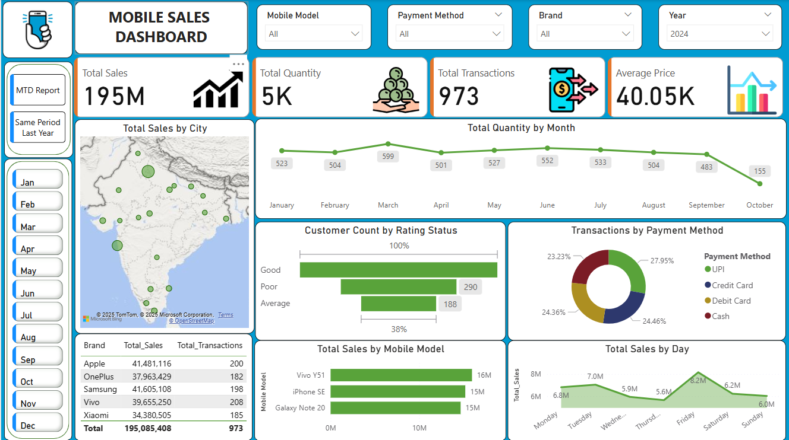
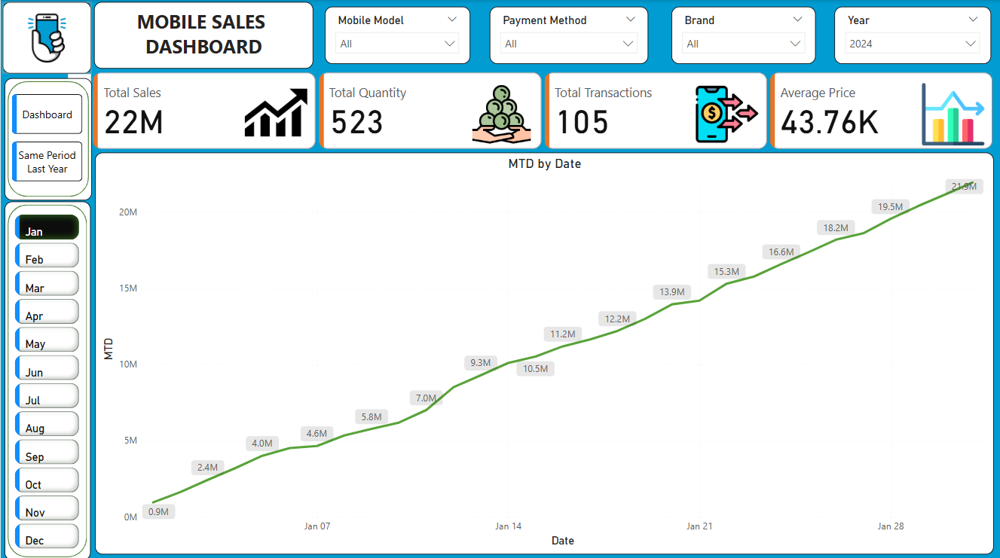
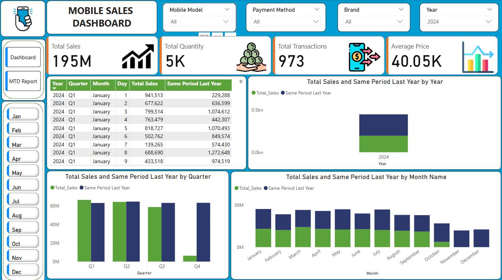

# Mobile Sales Dashboard

**A Power BI report tracking 2024 mobile-sales performance across India.**

---

## 📝 Data

- **`Mobile Sales Data.xlsx`**  
  Contains raw sales transactions with columns:
  - **Transaction ID**: Unique sale identifier  
  - **Day / Month / Year**: Date components  
  - **Day Name**: Weekday of transaction  
  - **City**: Sale location  
  - **Brand**: Phone manufacturer  
  - **Mobile Model**: Specific model name  
  - **Units Sold**: Number of units  
  - **Price Per Unit**: Sale price per unit  
  - **Customer Name / Age**: Buyer details  
  - **Payment Method**: UPI, Credit Card, Debit Card, Cash  
  - **Customer Ratings**: 1–5 star  

The report performs basic transformations in Power Query (e.g. calculating **Total Sales** = Units Sold × Price Per Unit).

---

The report performs basic transformations in Power Query (e.g. calculating **Total Sales** = Units Sold × Price Per Unit).

---

## 🚀 Getting started

1. **Download** `dashboard.pbix` and `data/Mobile Sales Data.xlsx`  
2. **Open** `dashboard.pbix` in Power BI Desktop  
3. **Refresh** the data source if you want to pull in updated records  
4. Use the slicers at the top to filter by **Year**, **Brand**, **Model**, or **Payment Method**  
5. Toggle between the **Dashboard** and **MTD Report** pages via the left-nav buttons  

---

## 📊 Dashboard overview

### 1. Main dashboard  

- **Cards**: Total Sales (₹195 M), Quantity (5 K), Transactions (973), Avg. Price (₹40 K)  
- **Map**: Sales by city (largest bubbles in Mumbai, Delhi, Bangalore)  
- **Line**: Monthly quantity trend—peak in June/July, dip into October  
- **Bar & Donut**:  
  - Customer rating distribution (Good ≫ Average ≫ Poor)  
  - Payment mix (UPI ~28%, Cards ~49% combined, Cash ~23%)  
- **Tables & Bars**:  
  - Top 5 brands by sales & transactions  
  - Top 3 models (Vivo Y51, iPhone SE, Galaxy Note 20)  
- **Area**: Daily sales pattern—Saturday spikes highest (~₹8.2 M)

---

### 2. Month-to-Date (MTD) report  

Cumulative day-by-day sales in January 2024, rising from ₹0.9 M on Jan 1 to ₹21.9 M by month-end. Use this page to track MTD progress for any selected month.

---

### 3. Year-over-Year comparison  

- **Table**: Daily sales vs. same period last year (e.g. Jan 1: ₹0.94 M vs. ₹0.23 M LY)  
- **Bar charts**:  
  - Total Sales & LY by **Quarter** (Q1–Q4)  
  - Total Sales & LY by **Month** (Jan–Dec)

---

## 🔍 Key insights

- **Strong January start**: ₹22 M MTD in Jan 24 vs. ₹19 M LY  
- **Brand leaders**: Samsung and Apple each over ₹41 M in sales; Vivo highest transaction count (208)  
- **Payment trends**: UPI is now the dominant method (~28% of transactions)  
- **Weekend peak**: Saturday sales jump ~15% above mid-week levels  
- **Customer satisfaction**: Majority of purchasers gave “Good” ratings; poor ratings under 20%

---

## 📞 Contact

_Chirag Pandey_  
– Email: chiragpandey0504@gmail.com  
– GitHub: [@chiragpandey0504](https://github.com/chiragpandey0504)  

Feel free to clone, explore, and adapt this dashboard for your own mobile-sales analytics!  
